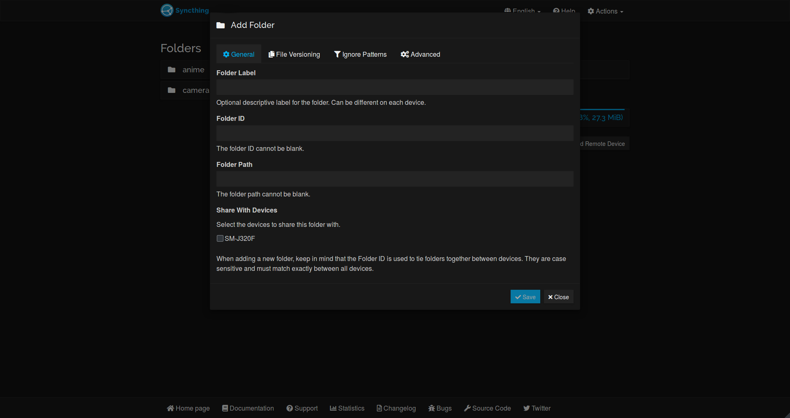
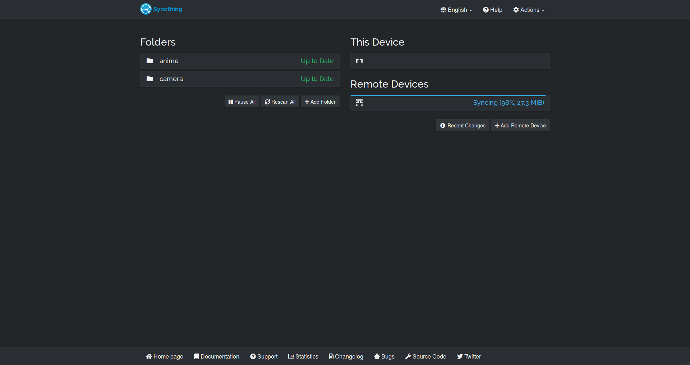

# Syncthing-DeepDark

Sync files in the dark. (Syncthing dark theme) 

This is a dark theme for Syncthing inspired by [FT DeepDark](https://addons.mozilla.org/en-US/firefox/addon/ft-deepdark/?src=search). 

Also, credit where credit is due for the color palettes down bellow. ([@KDE](https://github.com/KDE), [@horst3180](https://github.com/horst3180), [@linuxmint](https://github.com/linuxmint), [Firefox](https://www.mozilla.org/en-US/firefox/new/), [YouTube](https://www.youtube.com/) and [Discord](https://discordapp.com/))

Theme as a userstyle [here](https://openusercss.org/theme/5b72ded6d24aea0c00e96927).

### **You can also install all my themes at once from [here](https://github.com/RaitaroH/Import-All-Deepdark).**

# Screenshots
Main Page

Add folder

# Colors
The colors are available in the code; different colors can be used.

Even more colors can be used!
